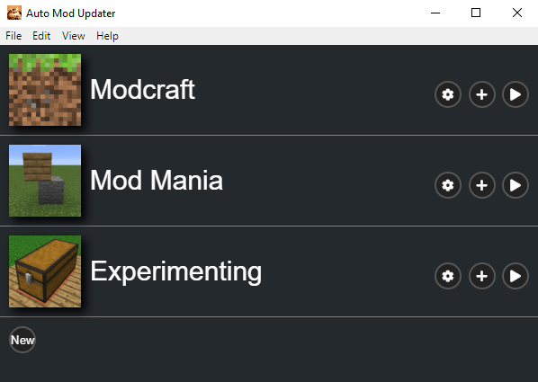
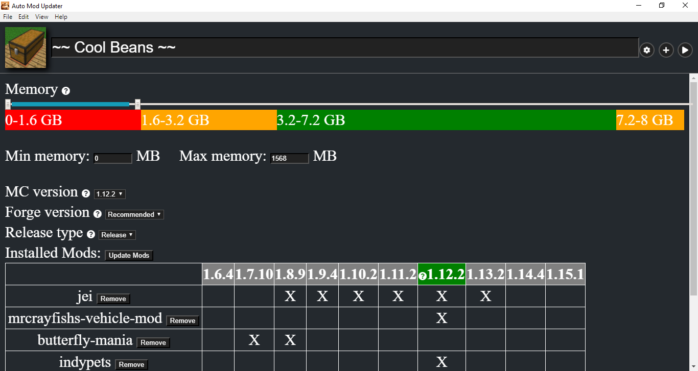
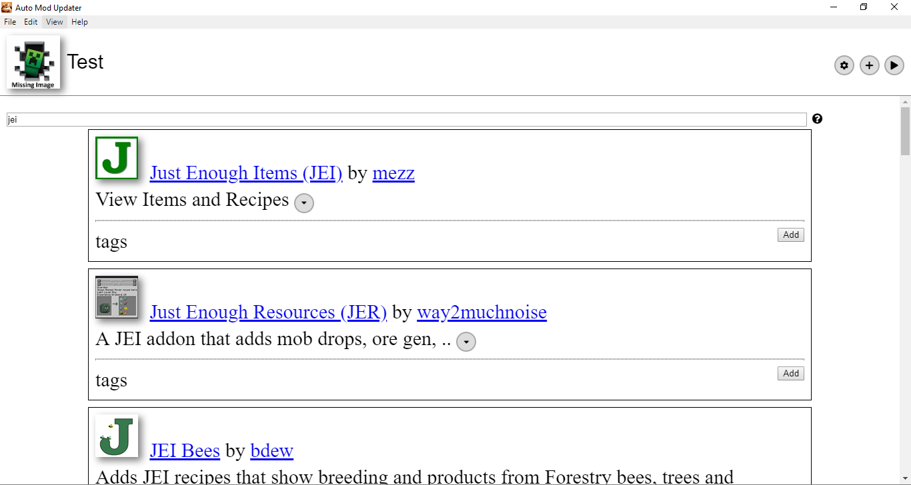
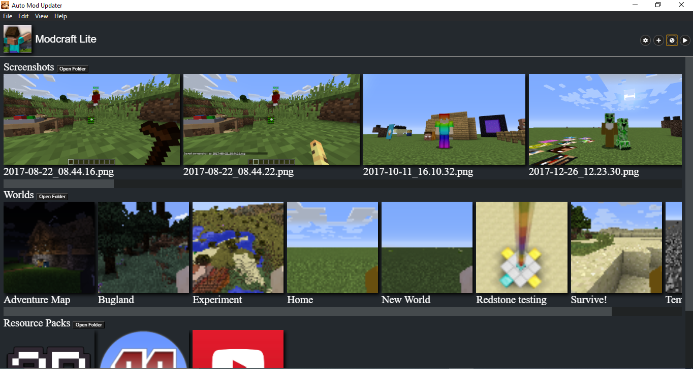

# Modpack Creator
Allows users to easily add and update mods without having to worry about different MC versions.
This is primarily for people who want to play modded Minecraft, but want to edit an existing modpack or create their own.

Features:
 - Finds the best MC version that is most compatible with your mods
 - Automatically installs [Forge](https://files.minecraftforge.net/) & updates mods
 - Simple, intuitive interface + manage settings
 - Store multiple profiles
 - Search [Curseforge](https://www.curseforge.com/minecraft/mc-mods) (or add from external sites)

## Screenshots

## How to Install
1. Go to [the latest release](https://github.com/funblaster22/Modpack-Creator/releases/latest)
2. Download “`auto-mod-updater-setup-1.x.x.exe`“ (NOT .blockmap)
3. Run installer
4. Note: Windows SmartScreen & Chrome may warn you that the file is unsafe, so
   click more options, then "download/run anyway". I promise there are no
   viruses; this will show up until it gets enough "reputation" and because
   code signing is expensive :/

## Contributing
1. Prerequisites: have [node.js](https://nodejs.org/en/) installed
2. Either:
    1. Run "`git clone https://github.com/funblaster22/Modpack-Creator.git`" (requires [git](https://git-scm.com/downloads))
    2. [Download zip](https://github.com/funblaster22/Modpack-Creator/archive/Main.zip) and extract
3. Run "`npm install`" in the same directory as this project
4. Run "`npm start`" and wait
